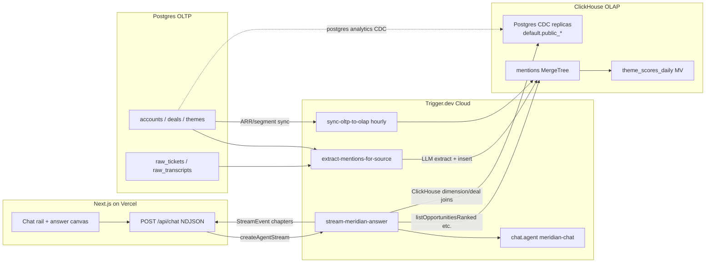

# Meridian Architecture

Product intelligence agent for Meridian Payments Billing PMs. Answers
"what should we prioritize next quarter?" from support tickets, interview
transcripts, CRM deals, and competitive intel — as visual chapters, not
walls of text.

## Why OLTP + OLAP

| Layer | Store | Owns | Answers |
| --- | --- | --- | --- |
| **OLTP** | Postgres (ClickHouse-managed) | Mutable business state: accounts, deals, themes, competitors, raw tickets/transcripts | "What is this account's ARR right now?" / "Which deal blocked on theme X?" |
| **OLAP** | ClickHouse Cloud service `Meridian`, database `meridian` | Derived analytical signal: `mentions` (1,802 rows) + `theme_scores_daily` MV | "Across all signal, what matters most?" / ARR-weighted rankings, trends, evidence |
| **CDC** | ClickHouse Cloud replication `postgres analytics`, database `default` | `public_accounts`, `public_deals`, `public_themes`, `public_competitors`, and raw-source replicas | Supplies dimensions/facts for ClickHouse-only analytical joins |

Denormalized `account_arr` / `account_segment` on every mention keep ranking
queries in ClickHouse. The `sync-oltp-to-olap` Trigger task propagates ARR /
segment changes from Postgres → ClickHouse so aggregations stay current
without re-extraction.

The user created `postgres analytics` on 2026-07-21; ClickHouse Cloud reports
it **Running**. Its initial snapshot is complete on the same ClickHouse service
endpoint: accounts 123, competitors 8,
deals 14, raw tickets 956, raw transcripts 63, and themes 8. The replicas are
`SharedReplacingMergeTree` tables with PeerDB version/deletion metadata. Query
functions use `FINAL` plus `_peerdb_is_deleted = 0` for current-state reads.
All six replica counts exactly match their Postgres source tables.

## System diagram



## Agent contract

Frontend consumes **NDJSON `StreamEvent`s** (`types/chapter.ts`):

`message_start` → `status*` → (`chapter_start` → `chapter_intro_delta*` → `chapter_visual` → `chapter_callout*`)* → `message_end`

Hybrid orchestration: **scripted chapter sequence** for "what should we
prioritize?" (demo reliability); **LLM + tools** via `chat.agent()` for
open follow-ups. Visual `data` for ranking / evidence / matrix / impact is
literal query output from `types/agent-tools.ts`.

## Data path

1. Seed accounts/themes/competitors → Postgres
2. Generate tickets / transcripts / deals → Postgres
3. `extractAllMentions` fans out via `batchTrigger` → ClickHouse `mentions`
4. Agent queries ClickHouse for analytical signal plus replicated names,
   mutable deals/themes, and competitor reference
5. Hourly sync keeps denormalized ARR/segment fresh
6. Postgres remains the operational writer; CDC makes changes available for
   ClickHouse joins without production analytical read-through

## Current tool data sources

| Tool/path | Derived ClickHouse data | ClickHouse CDC replicas |
| --- | --- | --- |
| Global prioritization | Mention/account aggregations; primary scoring inputs | Theme labels, competitor reference, mutable deal inputs |
| Account question (`What does Figma want?`) | Account theme rollups and verbatim evidence | Account identity, theme labels, deal context |
| Theme trends / volume trap | Weekly/count/ARR aggregations | Theme labels and total book ARR |
| Competitors | — for the standalone matrix | Replicated static competitor reference |
| Evidence | Mentions, source quotes, requesting-account rollups | Theme/account names |
| Impact | Mention-derived expansion candidates | Mutable deals and account names |

All analytical tools use typed, parameterized ClickHouse queries. Postgres is
still used by operational generation/extraction and the denormalized-field sync
task, but no agent query function imports the Postgres client.

## Verified production numbers (2026-07-21)

| Artifact | Count |
| --- | ---: |
| Accounts | 123 |
| Support tickets | 956 |
| Interview transcripts | 63 |
| Deals (lost with blocking theme) | 11 |
| Extracted mentions (`meridian.mentions`) | 1,802 |
| Mention storage | 212,290 bytes (207.31 KiB), 10 active parts |
| Daily rollup rows / storage | 617 / 18,329 bytes (17.90 KiB) |
| Themes | 8 |
| CDC accounts / deals / themes / competitors | 123 / 14 / 8 / 8 |
| CDC raw tickets / transcripts | 956 / 63 |

## Viewing ClickHouse data

`Sync to ClickHouse` is the replication setup/status page, not the table
browser. In ClickHouse Cloud, open the **Meridian** ClickHouse service, then
**SQL Console**, and run:

```sql
SHOW DATABASES;
USE meridian;
SHOW TABLES;
SELECT count(*) FROM mentions;
SELECT database, name, engine, total_rows, formatReadableSize(total_bytes)
FROM system.tables
WHERE database NOT IN ('system', 'information_schema', 'INFORMATION_SCHEMA')
ORDER BY database, name;
```

The result includes derived objects in `meridian` and replicated `public_*`
objects in `default`. The `meridian-oltp` Storage view only describes the
separate Postgres service.
